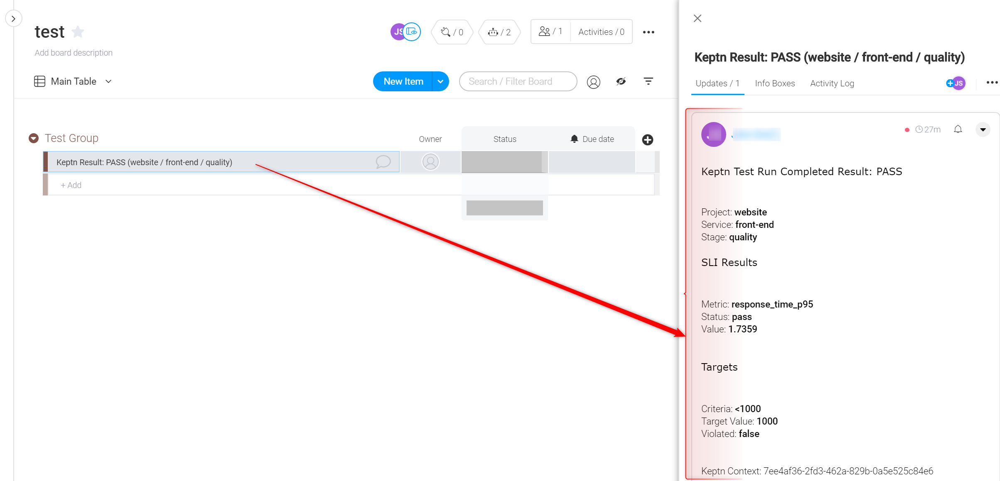
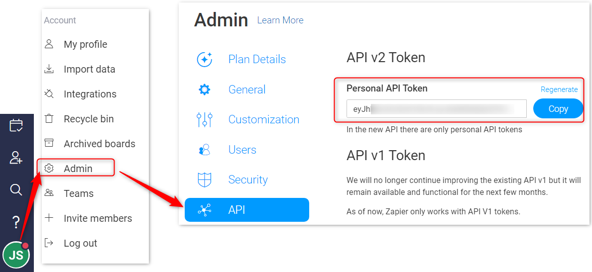
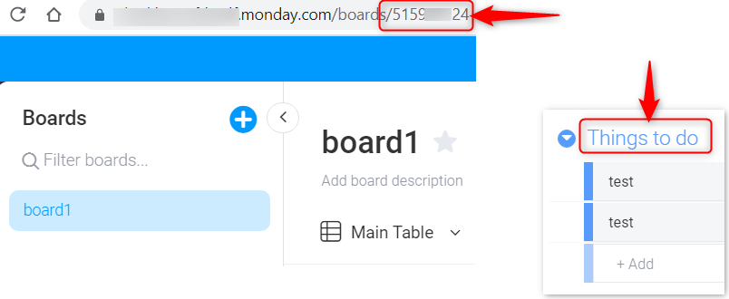

# Monday.com Service
This keptn service creates items on [Monday.com](https://monday.com) boards when a keptn evaluation (`sh.keptn.event.start-evaluation`) is performed. The service subscribes to the following keptn events:

* `sh.keptn.events.evaluation-done`



# Installation

## Gather Info from Monday.com

You'll need the following info from your Monday.com account.

1. Your **API key** for Monday.com. Login and click the username circle. Go to account > admin and generate an API token.



2. The **Board ID** on which you want the results to appear. You can get this from the URL.

3. The **title text of the 'group'** under which you want the results to appear (eg. "Things to do")



## Deploy Service onto Keptn

1. Clone this repo onto the keptn machine.
2. Create a secret to hold the OSTicket URL, API Key (substituting the values for **your** values below):
```
kubectl create secret generic monday-details -n keptn --from-literal=api-key='abcd1234' --from-literal=board-id='def123' --from-literal=group-name='xyz987'
```
3. Use kubectl to apply both the `monday-service.yaml` and `monday-distributor.yaml` files on the keptn cluster:

```
cd ~/monday-service
kubectl apply -f monday-service.yaml -f monday-distributor.yaml
```

Expected output:

```
deployment.apps/monday-service created
service/monday-service created
deployment.apps/monday-service-distributor created
```

# Verification of Installation
```
kubectl -n keptn get pods | grep monday
```

Expected output:

```
monday-service-*-*                   1/1     Running   0   12s
monday-service-distributor-*-*       1/1     Running   0   12s
```

Now start an evaluation and wait for the ticket to be created.
Note: You must have your services tagged with `keptn_project`, `keptn_service` and `keptn_stage`.

```
keptn send event start-evaluation --project=*** --stage=*** --service=*** --timeframe=2m
```

# Debugging
A debug log is available in the `monday-service` pod at `/var/www/html/logs/mondayService.log`

```
kubectl exec -itn keptn monday-service-*-* cat /var/www/html/logs/mondayService.log
```

## Compatibility Matrix

| Keptn Version    | Monday.com API Version |
|:----------------:|:----------------------:|
|     0.6.1        |            v2          |

# Contributions, Enhancements, Issues or Questions
Please raise a GitHub issue or join the [Keptn Slack channel](https://join.slack.com/t/keptn/shared_invite/enQtNTUxMTQ1MzgzMzUxLWMzNmM1NDc4MmE0MmQ0MDgwYzMzMDc4NjM5ODk0ZmFjNTE2YzlkMGE4NGU5MWUxODY1NTBjNjNmNmI1NWQ1NGY).
